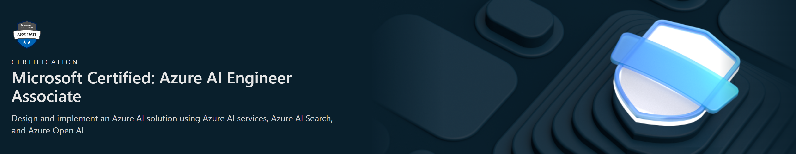

# Microsoft Certified: Azure Azure AI Engineer Associate - Study Notes
## Designing and Implementing a Microsoft Azure AI Solution

**Study Notes for Microsoft Azure AI Engineer Associate Examination (AI-102)**  
- Sharing the notes that I used as part of my revision for the AI-102 exam (passed on [first attempt](https://learn.microsoft.com/api/credentials/share/en-us/KennethLeung-5704/69A89CC4F0578129?sharingId=90CA02B9FB836262) in Jan 2025)
- Compilations based on self-directed lessons from [Microsoft Learn - Designing and Implementing a Microsoft Azure AI Solution](https://learn.microsoft.com/en-us/training/courses/ai-102t00#course-syllabus)

___
### Overview
As a Microsoft Azure AI engineer, you build, manage, and deploy AI solutions that leverage Azure AI.

Your responsibilities include participating in all phases of AI solutions development, including:
- Requirements definition and design
- Development
- Deployment
- Integration
- Maintenance
- Performance tuning
- Monitoring

You work with solution architects to translate their vision. You also work with data scientists, data engineers, Internet of Things (IoT) specialists, infrastructure administrators, and other software developers to:
- Build complete and secure end-to-end AI solutions.
- Integrate AI capabilities in other applications and solutions.

___
## Notes Structure
- [**Learning Path 1: Get started with Azure AI Services**](https://github.com/kennethleungty/Azure-AI-Engineer-Associate-Notes/tree/main/1%20-%20Get%20started%20with%20Azure%20AI%20Services)
    - Azure AI Services is a collection of services that are building blocks of AI functionality you can integrate into your applications. 
    - In this learning path, you'll learn how to provision, secure, monitor, and deploy Azure AI Services resources and use them to build intelligent solutions.
- [**Learning Path 2: Create computer vision solutions with Azure AI Vision**](https://github.com/kennethleungty/Azure-AI-Engineer-Associate-Notes/tree/main/2%20-%20Create%20computer%20vision%20solutions%20with%20Azure%20AI%20Vision)
    - Computer vision is an area of artificial intelligence that deals with visual perception. Azure AI Vision includes multiple services that support common computer vision scenarios.
- [**Learning Path 3: Develop natural language processing solutions with Azure AI Services**](https://github.com/kennethleungty/Azure-AI-Engineer-Associate-Notes/tree/main/3%20-%20Develop%20natural%20language%20processing%20solutions%20with%20Azure%20AI%20Services)
    - Natural language processing (NLP) solutions use language models to interpret the semantic meaning of written or spoken language. You can use the Language Understanding service to build language models for your applications.
- [**Learning Path 4: Implement knowledge mining solutions with Azure AI Search**](https://github.com/kennethleungty/Azure-AI-Engineer-Associate-Notes/tree/main/4%20-%20Implement%20knowledge%20mining%20solutions%20with%20Azure%20AI%20Search)
    - Do you have information locked up in structured and unstructured data sources? Using Azure AI Search, you can extract key insights from this data, and enable applications to search and analyze them.
- [**Learning Path 5: Develop solutions with Azure AI Document Intelligence**](https://github.com/kennethleungty/Azure-AI-Engineer-Associate-Notes/tree/main/5%20-%20Develop%20solutions%20with%20Azure%20AI%20Document%20Intelligence)
    - In this learning path, discover how Azure AI Document Intelligence solutions can enable you to capture data from typed or hand-written forms. - You will also learn how to build a solution for your custom form types and integrate that solution into an Azure Cognitive Search pipeline.
- [**Learning Path 6: Develop Generative AI solutions with Azure OpenAI Service**](https://github.com/kennethleungty/Azure-AI-Engineer-Associate-Notes/tree/main/6%20-%20Develop%20Generative%20AI%20solutions%20with%20Azure%20OpenAI%20Service)
    - Azure OpenAI Service provides access to OpenAI's powerful large language models such as GPT and Embeddings models. These models enable various natural language processing (NLP) solutions to understand, converse, and generate content. Users can access the service through REST APIs, SDKs, and Azure AI Foundry.

___
## Course Synopsis
This course was designed for software engineers concerned with building, managing and deploying AI solutions that leverage Azure AI Services, Azure AI Search, and Azure OpenAI. 

They are familiar with C# or Python and have knowledge on using REST-based APIs to build computer vision, language analysis, knowledge mining, intelligent search, and generative AI solutions on Azure.

___
## To-Do
- Resolve formatting of code blocks on some PDFs
- Make table of contents clickable on PDFs

___
## References
Study Guide: https://learn.microsoft.com/en-us/credentials/certifications/resources/study-guides/ai-102
